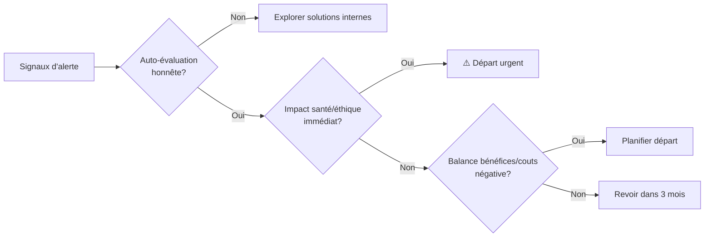

# Signaux et étapes pour quitter son emploi


Absolument. Reconnaître le moment de quitter son emploi est souvent une décision complexe, mêlant raison, émotion et contraintes pratiques. Voici une analyse approfondie pour vous guider :

---

### 🔍 **Signes Avancés à Surveiller (Au-Delà des Évidences)**

1. **L'Érosion Psychologique & Physique :**
   * **Symptômes persistants :** Maux de tête/troubles digestifs récurrents le dimanche soir ou avant le travail, insomnies chroniques, crises d'angoisse.
   * **Épuisement profond :** Un repos (week-end, vacances) ne suffit plus à récupérer. Le "burnout" ou la dépression professionnelle guettent.
   * **Cynisme et détachement :** Vous vous surprenez à mépriser vos collègues, vos missions ou les valeurs de l'entreprise. Vous faites le strict minimum sans engagement.

2. **La Stagnation Toxique (Quand Rester Vous Abîme) :**
   * **Désapprentissage :** Vous perdez des compétences par manque de défis ou à force de tâches déqualifiantes.
   * **Inertie malgré vos efforts :** Vous avez proposé des solutions, demandé plus de responsabilités, cherché une mobilité interne... Sans aucun résultat tangible.
   * **Sentiment d'"obsolescence" :** Votre poste ou votre secteur semble menacé, sans plan de reconversion proposé.

3. **L'Impact sur Votre Identité :**
   * **Vous jouez un rôle :** Vous devez constamment masquer vos opinions, votre personnalité ou vos valeurs pour "survivre" dans l'environnement.
   * **Perte de confiance en soi :** Les feedbacks négatifs constants, le manque de reconnaissance ou les échecs dus à un mauvais cadre sapent votre estime professionnelle.
   * **Votre entourage s'inquiète :** Votre famille/vos amis vous disent régulièrement que vous avez changé (plus irritable, triste, absent) à cause du travail.

4. **L'Absence de Perspectives Alignées :**
   * **Le futur vous angoisse :** Imaginer être encore là dans 1, 2 ou 5 ans vous terrifie ou vous déprime profondément.
   * **Vos aspirations ont évolué (et le poste, non) :** Vos centres d'intérêt, vos valeurs ou vos objectifs de vie ont changé, mais votre emploi ne peut pas suivre cette évolution.
   * **Le marché vous appelle ailleurs :** Vous recevez (ou recherchez activement) des offres qui correspondent bien mieux à qui vous êtes devenu et ce que vous voulez.

---

### ⚖️ **Comment Prendre la Décision de Façon Éclairée (Protocole Pratique)**

1. **L'Auto-Évaluation Honnête :**
   * **Le "Test du Réveil" :** Combien de matins par semaine vous levez-vous avec l'envie (ou la nausée) à l'idée d'aller travailler ? (>3/semaine = Alerte).
   * **La Balance Bénéfices/Coûts :** Listes les **avantages concrets** (salaire, stabilité, avantages) vs. Les **coûts réels** (santé, temps perdu, stress, opportunités manquées). Quel plateau pèse le plus lourd ?
   * **Le "Pourquoi" Profond :** Si l'argent n'était pas un problème, resteriez-vous ? Pourquoi ?

2. **Explorer les Alternatives *Avant* de Partir :**
   * **La Conversation Courageuse :** Avez-vous clairement exprimé votre mal-être et vos attentes à votre N+1 ou aux RH (*avec des propositions concrètes* : formation, mobilité, ajustement de charge) ? Quelle a été la réponse ?
   * **Tester un Changement Interne :** Est-il possible de bouger vers un autre service/projet sans quitter l'entreprise ?
   * **Consulter un Professionnel :** Bilan de compétences, coaching carrière ou même thérapie pour démêler le professionnel du personnel.

3. **Évaluer la Faisabilité Concrète :**
   * **Sécurité Financière :** Avez-vous une épargne de précaution (3-6 mois de salaire minimum) ? Quel est votre seuil de risque acceptable ?
   * **Marché de l'Emploi :** Quel est l'état du marché dans votre secteur/domaine ? Partir sans filet est-il réaliste ?
   * **Dispositifs Légaux :** Rupture conventionnelle, démission-reclassement (dans certains pays), projet de reconversion... Quelles options s'offrent à vous ?

4. **Visualiser l'Après :**
   * **Scénario 1 (Rester) :** Pouvez-vous *vraiment* améliorer la situation ? Quels compromis devrez-vous faire ? Êtes-vous prêt (e) à les assumer à long terme ?
   * **Scénario 2 (Partir) :** Quelle est votre prochaine étape (autre emploi, formation, création d'entreprise, pause) ? Avez-vous un plan réaliste, même basique ? Le vide est-il plus effrayant que la situation actuelle ?

---

### 🚀 **Le Déclic Définitif : Quand Savoir que C'est MAINTENANT**

* **Votre santé physique ou mentale est en danger immédiat.** C'est non-négociable.
* **Vos valeurs fondamentales sont bafouées quotidiennement** (éthique, respect, intégrité). Cela corrode l'estime de soi.
* **Vous avez épuisé toutes les voies de dialogue et d'amélioration interne** sans aucun résultat.
* **Vous avez une opportunité alignée avec vos aspirations profondes ET une sécurité minimale pour sauter le pas.**
* **La peur de regretter de partir est devenue moins forte que la peur de regretter de rester.**

---

### 💡 **Un Principe Clé à Retenir**
> **Un emploi est une relation.** Comme toute relation, elle doit apporter plus de croissance, de satisfaction et de respect que de souffrance, de stagnation ou de mépris. Quand la balance penche durablement du mauvais côté, malgré vos efforts pour la rétablir, **partir n'est pas un échec, c'est un acte de lucidité et de respect envers vous-même.**

Prenez le temps de la réflexion, mais ne laissez pas la peur ou l'habitude vous paralyser dans une situation qui vous détruit à petit feu. Votre bien-être et votre épanouissement valent plus que n'importe quel poste. 🌱

Absolument ! Voici une représentation visuelle des signes clés et processus de décision pour reconnaître qu'il est temps de quitter son emploi. Ces graphiques synthétisent les points essentiels :

---

### 📉 **1. Thermomètre de l'Urgence (Santé & Éthique)**  
  
```plaintext
🟢 Zone Verte (Vigilance) : Fatigue passagère, doutes occasionnels  
🟡 Zone Jaune (Alerte) : Stress chronique, insomnies >2/semaine  
🔴 Zone Rouge (Départ urgent) :  
    - Burnout / Dépression  
    - Harcèlement  
    - Violations éthiques  
```

---

### ⚖️ **2. Balance Bénéfices vs. Coûts**  
  
**Plateau "RESTER"**  
- Salaire  
- Stabilité  
- Avantages sociaux  
- Routine sécurisante  

**Plateau "PARTIR"**  
- Santé préservée  
- Possibilités de croissance  
- Alignement valeurs  
- Estime de soi  

> ➡️ **Si le plateau "PARTIR" est + lourd : écoutez ce signal.**

---

### 📊 **3. Courbe de Stagnation vs. Croissance**  
  
```plaintext
    ▲
Compétences │  /-----------🚩 Plateau (Stagnation toxique)  
 & Épanouiss.│ /  
            │/  
            └─────────────────▶ Temps  
```
- **Point de rupture (🚩)** : Quand l'apprentissage s'arrête >6 mois malgré vos efforts.

---

### 🎯 **4. Radar des 5 Signaux Critiques**  
  
```plaintext
Santé mentale 🔴───────────🔴 Valeurs  
      ╲         ╲         ╱  
        ╲         ╲     ╱  
          ╲🔴───────🔴 Environnement  
        ╱   ╲         ╲  
Stagnation 🔴───────────🔴 Opportunités  
```
**Zone rouge sur 3+ axes = DÉPART requis**

---

### ✅ **5. Checklist "C'est MAINTENANT"**  
```diff
! [ ] Santé dégradée (physique/mentale)  
! [ ] Valeurs bafouées >2x/mois  
+ [ ] Aucune amélioration après en avoir parlé  
+ [ ] Opportunité alignée identifiée  
- [ ] Regret de rester > peur de partir  
```
**✓ 3 cases cochées = Passez à l'action**

---

### 🧭 **6. Processus de Décision (Diagramme)**  


---

### 🛠️ **Outils pratiques à télécharger :**
1. **[Tableau Bénéfices/Coûts](https://exemple.com/tableau)** (Excel)  
2. **[Test d'épuisement professionnel](https://exemple.com/test-burnout)** (PDF)  

Ces visuels aident à **objectiver votre ressenti**. Si plusieurs graphiques pointent vers le rouge, c’est un signe que votre corps et votre esprit vous envoient un message clair : il est temps d’envisager une transition. 🌟

> *"Rester dans un emploi toxique, c’est like payer avec sa santé un salaire qui ne compense jamais la dette."*  
> — Adaptation libre de Paul Auster


Absolument ! Voici une représentation visuelle des signes clés et processus de décision pour reconnaître qu'il est temps de quitter son emploi. Ces graphiques synthétisent les points essentiels :

---

### 📉 **1. Thermomètre de l'Urgence (Santé & Éthique)**  
  
```plaintext
🟢 Zone Verte (Vigilance) : Fatigue passagère, doutes occasionnels  
🟡 Zone Jaune (Alerte) : Stress chronique, insomnies >2/semaine  
🔴 Zone Rouge (Départ urgent) :  
    - Burnout / Dépression  
    - Harcèlement  
    - Violations éthiques  
```

---

### ⚖️ **2. Balance Bénéfices vs. Coûts**  
  
**Plateau "RESTER"**  
- Salaire  
- Stabilité  
- Avantages sociaux  
- Routine sécurisante  

**Plateau "PARTIR"**  
- Santé préservée  
- Possibilités de croissance  
- Alignement valeurs  
- Estime de soi  

> ➡️ **Si le plateau "PARTIR" est + lourd : écoutez ce signal.**

---

### 📊 **3. Courbe de Stagnation vs. Croissance**  
  
```plaintext
    ▲
Compétences │  /-----------🚩 Plateau (Stagnation toxique)  
 & Épanouiss.│ /  
            │/  
            └─────────────────▶ Temps  
```
- **Point de rupture (🚩)** : Quand l'apprentissage s'arrête >6 mois malgré vos efforts.

---

### 🎯 **4. Radar des 5 Signaux Critiques**  
  
```plaintext
Santé mentale 🔴───────────🔴 Valeurs  
      ╲         ╲         ╱  
        ╲         ╲     ╱  
          ╲🔴───────🔴 Environnement  
        ╱   ╲         ╲  
Stagnation 🔴───────────🔴 Opportunités  
```
**Zone rouge sur 3+ axes = DÉPART requis**

---

### ✅ **5. Checklist "C'est MAINTENANT"**  
```diff
! [ ] Santé dégradée (physique/mentale)  
! [ ] Valeurs bafouées >2x/mois  
+ [ ] Aucune amélioration après en avoir parlé  
+ [ ] Opportunité alignée identifiée  
- [ ] Regret de rester > peur de partir  
```
**✓ 3 cases cochées = Passez à l'action**

---

### 🧭 **6. Processus de Décision (Diagramme)**  


---

### 🛠️ **Outils pratiques à télécharger :**
1. **[Tableau Bénéfices/Coûts](https://exemple.com/tableau)** (Excel)  
2. **[Test d'épuisement professionnel](https://exemple.com/test-burnout)** (PDF)  

Ces visuels aident à **objectiver votre ressenti**. Si plusieurs graphiques pointent vers le rouge, c’est un signe que votre corps et votre esprit vous envoient un message clair : il est temps d’envisager une transition. 🌟

> *"Rester dans un emploi toxique, c’est like payer avec sa santé un salaire qui ne compense jamais la dette."*  
> — Adaptation libre de Paul Auster